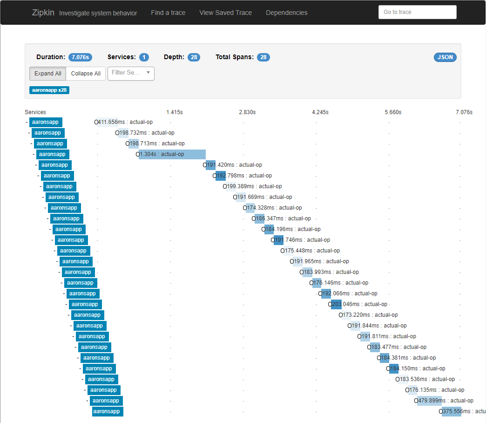

# Petabridge.Tracing.Zipkin

YAZDC - Yet Another Zipkin Driver for C#.

[Petabridge](https://petabridge.com/) develops highly tested, open source infrastructure software for .NET developers professionally.

We built this driver in order to provide a commercially supported, production-grade [Zipkin](https://zipkin.io/) driver for our customers but it's also available for users at large under the terms of the [Apache 2 License](LICENSE.md). We did not feel like the other drivers out there for Zipkin were particularly well-suited for the types of things our customers do (i.e. large scale IOT, finance, etc...) thus this project now exists and will be supported on behalf of our customers and users.

It's also worth noting that `Petabridge.Tracing.Zipkin` supports the [OpenTracing](http://opentracing.io/) standards natively. No special adapters on top of the library or anything like that. We support them out of the box. `Petabridge.Tracing.Zipkin` targets .NET Standard 2.0.

This driver is built to be extremely memory-efficient, thread-safe, and highly concurrent - it's powered by [Akka.NET](http://getakka.net/) actors under the hood.

## Quickstart
To get started with `Petabridge.Tracing.Zipkin`, install the NuGet package:

```
PS> Install-Package Petabridge.Tracing.Zipkin
```

And then instantiate an instance of the `ZipkinTracer` class, like so:

```csharp
	var url = "http://localhost:9411";
	var tracer = new ZipkinTracer(new ZipkinTracerOptions(url, "AaronsApp", debug:true));
	Console.WriteLine("Connected to Zipkin at {0}", url);
	Console.WriteLine("Type some gibberish and press enter to create a trace!");
	Console.WriteLine("Type '/exit to quit.");
	var line = Console.ReadLine();
	Span current = null;
	while (string.IsNullOrEmpty(line) || !line.Equals("/exit"))
	{
	    IZipkinSpanBuilder sb = null;
	    if (string.IsNullOrEmpty(line))
	    {
	        sb = tracer.BuildSpan("no-op").WithTag("empty", true);
	        if (current != null)
	        {
	            current.Finish();
	        }
	    }
	    else
	    {
	        sb = tracer.BuildSpan("actual-op").WithTag("empty", false);
	        if (current != null)
	        {
	            current.Finish();
	            sb = sb.AsChildOf(current);
	        }
	    }

	    current = sb.Start();

	    if (!string.IsNullOrEmpty(line))
	    {
	        current.Log(line);
	    }

	    line = Console.ReadLine();
	}

	current?.Finish();

	tracer.Dispose(); // call dispose when you're done, please.
}
```

That's actually our entire demo application and it works nicely:



### Firing Up Zipkin
Need help setting up your own Zipkin instance? If you have [Docker](https://www.docker.com/) installed on your system, then the fastest way to get up and running is using one of the Docker templates for Zipkin defined here: https://github.com/openzipkin/docker-zipkin

Clone that repository and then try the following (from the root directory of your local clone):

```
PS> docker-compose -f docker-compose.yml -f docker-compose-cassandra.yml up
```

Docker will be running at `http://localhost:9411` by default, usually.

## Building this solution
To run the build script associated with this solution, execute the following:

**Windows**
```
c:\> build.cmd all
```

**Linux / OS X**
```
c:\> build.sh all
```

If you need any information on the supported commands, please execute the `build.[cmd|sh] help` command.

This build script is powered by [FAKE](https://fake.build/); please see their API documentation should you need to make any changes to the [`build.fsx`](build.fsx) file.

#### Previewing Documentation
To preview the documentation for this project, execute the following command at the root of this folder:

```
C:\> serve-docs.cmd
```

This will use the built-in `docfx.console` binary that is installed as part of the NuGet restore process from executing any of the usual `build.cmd` or `build.sh` steps to preview the fully-rendered documentation. For best results, do this immediately after calling `build.cmd buildRelease`.

### Release Notes, Version Numbers, Etc
This project will automatically populate its release notes in all of its modules via the entries written inside [`RELEASE_NOTES.md`](RELEASE_NOTES.md) and will automatically update the versions of all assemblies and NuGet packages via the metadata included inside [`common.props`](src/common.props).

If you add any new projects to the solution created with this template, be sure to add the following line to each one of them in order to ensure that you can take advantage of `common.props` for standardization purposes:

```
<Import Project="..\common.props" />
```